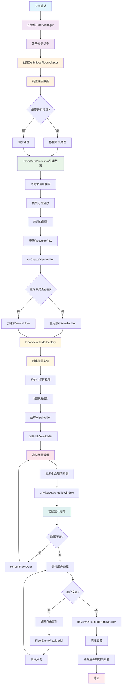
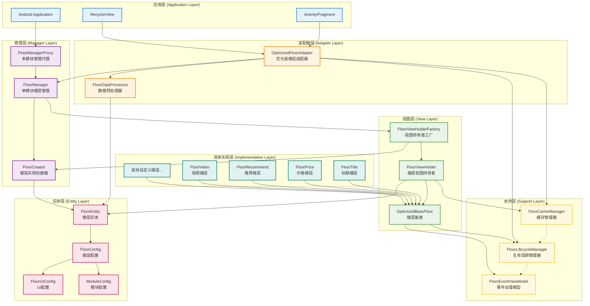

# FloorManager SDK 技术文档

## 1. 概述

FloorManager SDK 是一个为 Android 应用设计的楼层渲染框架，旨在解决复杂页面中多种内容模块的统一管理和高效渲染问题。该 SDK 提供了一套完整的楼层注册、缓存、生命周期管理和数据处理解决方案。

### 1.1 主要特性

- **模块化架构**：支持多模块独立管理，每个模块可拥有自己的楼层配置
- **高性能渲染**：内置缓存机制和异步数据处理，提升列表渲染性能
- **完整生命周期管理**：规范化的楼层生命周期回调，确保资源正确释放
- **灵活UI配置**：支持背景、间距、圆角等UI属性的动态配置
- **事件统一处理**：提供统一的事件分发机制，简化楼层间通信

### 1.2 适用场景

- 复杂商品详情页面
- 多模块首页展示
- 动态内容列表
- 需要楼层化管理的任何界面

## 2. 架构设计

### 2.1 整体架构

```
┌─────────────────────────────────────────────────────────────┐
│                     FloorManager SDK                        │
├─────────────────────────────────────────────────────────────┤
│  Manager Layer (管理层)                                      │
│  ├─ FloorManagerProxy    # 多模块管理代理                   │
│  ├─ FloorManager         # 单模块楼层管理                   │
│  └─ FloorCreator         # 楼层实例创建器                   │
├─────────────────────────────────────────────────────────────┤
│  Adapter Layer (适配器层)                                   │
│  ├─ OptimizedFloorAdapter  # 优化版楼层适配器               │
│  └─ FloorDataProcessor     # 数据预处理器                   │
├─────────────────────────────────────────────────────────────┤
│  View Layer (视图层)                                        │
│  ├─ FloorViewHolder        # 楼层视图持有者                 │
│  ├─ FloorViewHolderFactory # 视图持有者工厂                 │
│  └─ OptimizedBaseFloor     # 楼层基类                       │
├─────────────────────────────────────────────────────────────┤
│  Support Layer (支持层)                                     │
│  ├─ FloorCacheManager      # 缓存管理器                     │
│  ├─ FloorLifecycleManager  # 生命周期管理器                 │
│  └─ FloorEventViewModel    # 事件处理模型                   │
├─────────────────────────────────────────────────────────────┤
│  Entity Layer (实体层)                                      │
│  ├─ FloorEntity           # 楼层实体                        │
│  ├─ FloorConfig           # 楼层配置                        │
│  ├─ FloorUIConfig         # UI配置                          │
│  └─ ModuleConfig          # 模块配置                        │
└─────────────────────────────────────────────────────────────┘
```

### 2.2 SDK设计流程图



该流程图展示了FloorManager SDK的完整工作流程，包含以下关键环节：

1. **初始化阶段**：应用启动后初始化FloorManager，注册楼层类型
2. **数据处理阶段**：通过FloorDataProcessor对数据进行预处理、过滤和排序
3. **视图创建阶段**：使用工厂模式创建ViewHolder，支持缓存复用
4. **渲染阶段**：绑定数据并渲染楼层视图
5. **生命周期管理**：完整的生命周期回调和资源管理
6. **事件处理**：统一的事件分发和处理机制

### 2.3 架构设计流程



该架构设计流程图展示了FloorManager SDK的分层架构设计，包含以下层级：

#### 🏗️ 架构层级说明

1. **应用层 (Application Layer)**
   - 负责与Android系统交互
   - 提供用户界面容器
   - 管理RecyclerView的显示

2. **管理层 (Manager Layer)**
   - 核心业务逻辑管理
   - 多模块和单模块管理
   - 楼层实例创建控制

3. **适配器层 (Adapter Layer)**
   - 数据适配和预处理
   - RecyclerView适配器实现
   - 数据流转控制

4. **视图层 (View Layer)**
   - 视图持有者管理
   - 楼层视图创建工厂
   - 楼层基类抽象

5. **支持层 (Support Layer)**
   - 缓存管理和优化
   - 生命周期管理
   - 事件处理支持

6. **实体层 (Entity Layer)**
   - 数据模型定义
   - 配置信息管理
   - 类型安全保障

7. **具体实现层 (Implementation Layer)**
   - 各种楼层的具体实现
   - 业务逻辑封装
   - 可扩展的楼层类型

#### 🔗 设计原则

- **单一职责**：每个层级都有明确的职责
- **依赖倒置**：高层模块不依赖低层模块
- **开闭原则**：对扩展开放，对修改关闭
- **接口隔离**：提供精简的接口定义

### 2.4 核心设计模式

- **代理模式**：FloorManagerProxy 管理多个 FloorManager 实例
- **工厂模式**：FloorViewHolderFactory 统一创建 ViewHolder
- **观察者模式**：FloorLifecycleObserver 实现生命周期监听
- **策略模式**：FloorDataProcessor 支持不同的数据处理策略

## 3. 核心组件详解

### 3.1 管理层组件

#### 3.1.1 FloorManagerProxy

```kotlin
/**
 * 楼层管理器代理类
 * 负责多模块的FloorManager实例管理和创建
 */
class FloorManagerProxy {
    companion object {
        fun getInstances(moduleName: String): FloorManager {}
    }
}
```

**主要功能**：
- 管理多个模块的 FloorManager 实例
- 提供线程安全的单例访问
- 支持模块间的隔离管理

#### 3.1.2 FloorManager

```kotlin
/**
 * 楼层管理器
 * 负责单模块的配置存储与楼层注册管理
 */
class FloorManager {
    fun registerFloor(
        floorId: String,
        floorClass: Class<out OptimizedBaseFloor?>,
        floorCustomConfig: FloorCustomConfig
    ) {
    }
    fun getClassById(mId: String): Class<out OptimizedBaseFloor?>? {}
    fun getFloorConfigById(mId: String): FloorCustomConfig? {}
    fun isFloorHasBeenRegistered(floorId: String): Boolean {}
}
```

**主要功能**：
- 楼层注册与管理
- 楼层配置存储
- 楼层类型映射维护

#### 3.1.3 FloorCreator

```kotlin
/**
 * 楼层创建器
 * 负责通过反射的方式创建楼层实现类实例
 */
class FloorCreator {
    fun createFloor(context: Context?, floorEntity: FloorEntity?, floorClass: Class<*>?): OptimizedBaseFloor?
    fun isValidFloorClass(floorClass: Class<*>): Boolean
}
```

**主要功能**：
- 使用反射机制创建楼层实例
- 构造函数适配和错误处理
- 楼层类有效性验证

### 3.2 适配器层组件

#### 3.2.1 OptimizedFloorAdapter

```kotlin
/**
 * 优化版楼层渲染Adapter
 * 解决了原版本的性能问题和代码结构问题
 */
class OptimizedFloorAdapter(
    private val context: Context,
    private val moduleName: String,
    private val coroutineScope: CoroutineScope? = null
) : RecyclerView.Adapter<RecyclerView.ViewHolder>(), FloorLifecycleObserver {
    
    fun setFloorData(data: List<FloorEntity>)
    fun refreshFloorData(floorType: String, floorData: Any)
    fun cleanup()
}
```

**主要功能**：
- 支持同步和异步数据处理
- 内置缓存管理和生命周期管理
- 提供错误处理和数据更新监听

#### 3.2.2 FloorDataProcessor

```kotlin
/**
 * 楼层数据预处理器
 * 负责楼层数据的过滤、分组、排序和UI配置
 */
class FloorDataProcessor(private val moduleName: String) {
    fun processFloorData(originalData: List<FloorEntity>): List<FloorEntity>
}
```

**主要功能**：
- 过滤未注册的楼层
- 楼层分组和排序
- 应用默认UI配置

### 3.3 视图层组件

#### 3.3.1 OptimizedBaseFloor

```kotlin
/**
 * 优化版楼层基类
 * 提供楼层的基础功能和生命周期管理
 */
abstract class OptimizedBaseFloor(
    protected val context: Context,
    val floorEntity: FloorEntity
) : LifecycleObserver, FloorLifecycleObserver {
    
    abstract fun initView()
    protected abstract fun renderData(floorData: Any?)
    fun showData(floorData: Any?)
    fun setRootView(view: View)
}
```

**主要功能**：
- 抽象楼层基类，定义楼层标准行为
- 安全的视图访问和错误处理
- 完整的生命周期回调支持

#### 3.3.2 FloorViewHolder

```kotlin
/**
 * 楼层ViewHolder
 * 负责楼层视图的持有和UI配置
 */
class FloorViewHolder(itemView: View, val floor: OptimizedBaseFloor) : RecyclerView.ViewHolder(itemView) {
    fun showData(floorData: Any?)
    private fun setFloorUI(rootView: View, config: FloorUIConfig?)
}
```

**主要功能**：
- 楼层视图容器管理
- UI配置应用（背景、间距、圆角等）
- 楼层数据绑定

### 3.4 支持层组件

#### 3.4.1 FloorCacheManager

```kotlin
/**
 * 楼层缓存管理器
 * 负责 ViewHolder 的缓存、复用和生命周期管理
 */
class FloorCacheManager(private val context: Context, private val moduleName: String) {
    fun getOrCreateFloorHolder(position: Int, floorEntity: FloorEntity): FloorViewHolder {}
    fun clearCache(floorType: String) {}
    fun clearAllCache() {}
}
```

**主要功能**：
- ViewHolder 缓存和复用
- 内存管理和清理
- 缓存状态监控

#### 3.4.2 FloorLifecycleManager

```kotlin
/**
 * 楼层生命周期管理器
 * 负责管理楼层的生命周期回调
 */
class FloorLifecycleManager {
    fun addObserver(observer: FloorLifecycleObserver)
    fun removeObserver(observer: FloorLifecycleObserver)
    fun notifyOnCreate()
    // ... 其他生命周期通知方法
}
```

**主要功能**：
- 生命周期观察者管理
- 统一的生命周期事件分发
- 支持多个观察者的注册和移除

### 3.5 实体层组件

#### 3.5.1 FloorEntity

```kotlin
/**
 * 楼层实体类
 * 用于传入adapter的楼层渲染数据
 */
class FloorEntity(val floorType: String) {
    var floorAttrEntity: FloorAttrEntity? = null
    var floorUIConfig: FloorUIConfig = FloorUIConfig()
    var floorHeight: Int = 0
    var floorData: Any? = null
}
```

#### 3.5.2 FloorUIConfig

```kotlin
/**
 * 楼层UI配置类
 * 包含楼层渲染时的UI相关属性配置
 */
class FloorUIConfig {
    var needSetBackground: Boolean = true
    var backgroundColor: Int = Color.WHITE
    var marginTop: Float = 0F
    var marginBottom: Float = 0F
    var cornerTopRadius: Float = 0F
    var cornerBottomRadius: Float = 0F
    var cornerType: CornerType = CornerType.NONE
}
```

## 4. 使用指南

### 4.1 基本使用流程

#### 步骤1：创建自定义楼层类

```kotlin
class CustomFloor(context: Context, floorEntity: FloorEntity) : OptimizedBaseFloor(context, floorEntity) {
    
    override fun initView() {
        // 初始化楼层视图
        val titleView = findViewById<TextView>(R.id.tv_title)
        val imageView = findViewById<ImageView>(R.id.iv_image)
    }
    
    override fun renderData(floorData: Any?) {
        // 渲染楼层数据
        val data = floorData as? CustomFloorData
        data?.let {
            findViewById<TextView>(R.id.tv_title)?.text = it.title
            // 设置其他UI元素
        }
    }
}
```

#### 步骤2：注册楼层

```kotlin
// 获取楼层管理器
val floorManager = FloorManagerProxy.getInstances("product_detail")

// 创建楼层配置
val floorConfig = FloorCustomConfig(
    floorLayoutId = R.layout.floor_custom_layout,
    floorGroupIndex = 1,
    floorGroupSortIndex = 0
)

// 注册楼层
floorManager.registerFloor("custom_floor", CustomFloor::class.java, floorConfig)
```

#### 步骤3：使用适配器

```kotlin
// 创建适配器
val floorAdapter = OptimizedFloorAdapter(
    context = this,
    moduleName = "product_detail",
    coroutineScope = lifecycleScope
)

// 设置错误监听
floorAdapter.onErrorListener = { message, error ->
    Log.e("FloorAdapter", "Error: $message", error)
}

// 设置数据更新监听
floorAdapter.onDataUpdateListener = { floorList ->
    Log.d("FloorAdapter", "Data updated: ${floorList.size} floors")
}

// 设置数据
val floorEntityList = listOf(
    FloorEntity("custom_floor").apply {
        floorData = CustomFloorData(title = "自定义楼层")
    }
)
floorAdapter.setFloorData(floorEntityList)

// 绑定到RecyclerView
recyclerView.adapter = floorAdapter
```

### 4.2 高级功能

#### 4.2.1 异步数据处理

```kotlin
val floorAdapter = OptimizedFloorAdapter(
    context = this,
    moduleName = "product_detail",
    coroutineScope = lifecycleScope // 传入协程作用域启用异步处理
)
```

#### 4.2.2 楼层UI配置

```kotlin
val floorEntity = FloorEntity("custom_floor").apply {
    floorUIConfig = FloorUIConfig().apply {
        backgroundColor = Color.parseColor("#F5F5F5")
        marginTop = 16f
        marginBottom = 16f
        cornerTopRadius = 8f
        cornerBottomRadius = 8f
        cornerType = FloorUIConfig.CornerType.ALL
    }
}
```

#### 4.2.3 模块配置

```kotlin
val moduleConfig = ModuleConfig(
    floorBackgroundColor = Color.WHITE,
    floorGroupTopMargin = 12f,
    floorGroupBottomMargin = 12f,
    floorGroupHorizontalMargin = 16f,
    floorCornerTopRadius = 8f,
    floorCornerBottomRadius = 8f
)

floorManager.moduleConfig = moduleConfig
```

#### 4.2.4 事件处理

```kotlin
class CustomFloor(context: Context, floorEntity: FloorEntity) : OptimizedBaseFloor(context, floorEntity) {
    
    override fun initView() {
        findViewById<View>(R.id.btn_action)?.setOnClickListener {
            // 发送点击事件
            val clickData = FloorClickData(
                floorType = floorEntity.floorType,
                clickPosition = "action_button",
                data = "自定义数据"
            )
            eventViewModel?.clickEvent?.postValue(clickData)
        }
    }
}

// 在Activity中观察事件
floorEventViewModel.clickEvent.observe(this) { clickData ->
    when (clickData.floorType) {
        "custom_floor" -> {
            // 处理自定义楼层点击事件
            handleCustomFloorClick(clickData)
        }
    }
}
```

## 5. 最佳实践

### 5.1 性能优化建议

1. **使用异步数据处理**：传入协程作用域启用异步数据处理
2. **合理设置缓存策略**：避免频繁创建相同类型的楼层
3. **及时清理资源**：在适当的时机调用 `cleanup()` 方法
4. **控制楼层数量**：避免一次性加载过多楼层

### 5.2 错误处理

```kotlin
// 设置全局错误处理器
floorAdapter.onErrorListener = { message, error ->
    // 记录错误日志
    CrashReport.reportException(error)
    
    // 用户友好的错误提示
    Toast.makeText(context, "页面加载异常，请稍后重试", Toast.LENGTH_SHORT).show()
}
```

### 5.3 内存管理

```kotlin
override fun onDestroy() {
    super.onDestroy()
    // 清理楼层适配器
    floorAdapter.cleanup()
}
```

### 5.4 调试技巧

```kotlin
// 获取缓存信息
val cacheInfo = floorAdapter.getCacheInfo()
Log.d("FloorAdapter", cacheInfo)

// 获取楼层状态
val floorStatus = customFloor.getFloorStatus()
Log.d("CustomFloor", floorStatus)
```

## 6. 注意事项

### 6.1 线程安全

- FloorManagerProxy 的 `getInstances()` 方法是线程安全的
- 楼层注册操作使用了 `@Synchronized` 注解保证线程安全
- UI操作必须在主线程中进行

### 6.2 内存泄漏防范

- 楼层基类自动管理生命周期，防止内存泄漏
- 及时调用 `cleanup()` 方法清理资源
- 避免在楼层中持有长期引用

### 6.3 兼容性考虑

- 支持 Android API 16+ 
- 使用 `@TargetApi` 注解处理版本兼容性
- 对低版本设备提供优雅降级

## 7. 技术支持

如果在使用过程中遇到问题，可以：

1. 查看日志输出，SDK内置了详细的调试信息
2. 使用 `getFloorStatus()` 和 `getCacheInfo()` 方法进行状态检查
3. 确保楼层类正确继承自 `OptimizedBaseFloor`
4. 检查楼层注册和配置是否正确

---

*本文档基于 FloorManager SDK 当前版本编写，如有更新请及时关注最新版本。* 